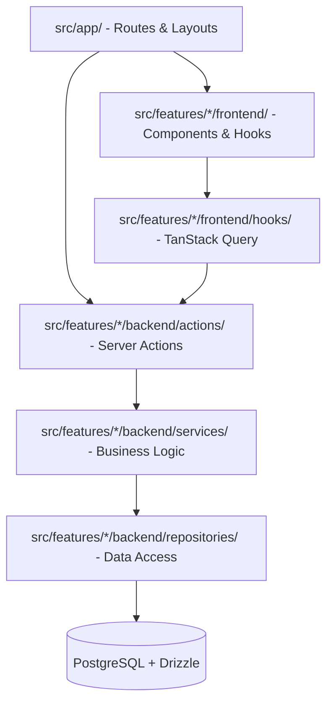
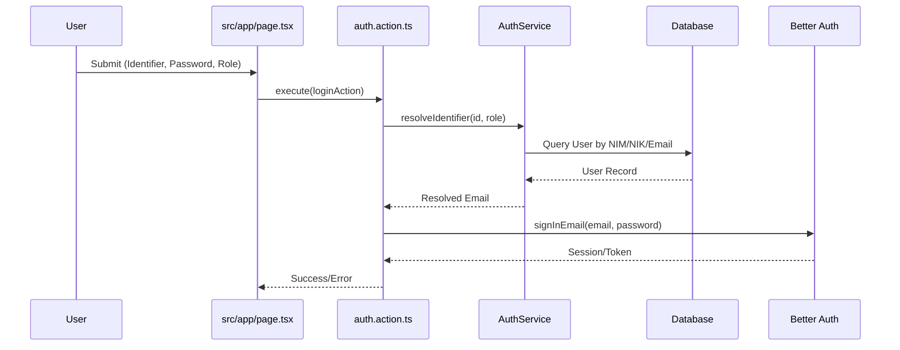

# PyLearn: Project Context & Instructions

Welcome to the PyLearn project. This document provides the foundational architecture, conventions, and workflows for developing and maintaining this application.

## Project Overview

PyLearn is a full-stack learning platform designed for Python education. It features a role-based access system for Students (Mahasiswa) and Lecturers (Dosen), organized around a strict feature-based architecture.

### Technology Stack

- **Runtime & Package Manager:** [Bun](https://bun.sh/)
- **Framework:** [Next.js 15](https://nextjs.org/) (App Router)
- **Styling:** [Tailwind CSS v4](https://tailwindcss.com/) & [shadcn/ui](https://ui.shadcn.com/)
- **Authentication:** [Better Auth](https://www.better-auth.com/) (Customized for NIM/NIK login)
- **Database & ORM:** [PostgreSQL](https://www.postgresql.org/) with [Drizzle ORM](https://orm.drizzle.team/)
- **Server Actions:** [next-safe-action](https://next-safe-action.dev/)
- **Data Fetching:** [TanStack Query v5](https://tanstack.com/query/latest) & [nuqs](https://nuqs.47ng.com/) for URL state.
- **Form Management:** [React Hook Form](https://react-hook-form.com/) with [Zod](https://zod.dev/)

---

## Architecture & Directory Structure

The project follows a **Feature-Based Architecture**. Code is organized by domain in `src/features` and shared logic in `src/shared`.

### Path Aliases
- `@/*` -> `src/*`
- `@/features/*` -> `src/features/*`
- `@/shared/*` -> `src/shared/*`

### Visual Architecture

### Core Directories
- `src/app/`: Next.js App Router pages and layouts. **Keep logic to a minimum here.**
- `src/features/`: Domain-specific logic (e.g., `auth`, `materi`, `tugas`).
    - `backend/`: Server-side logic.
        - `actions/`: `next-safe-action` entry points.
        - `services/`: Complex business logic and orchestration.
        - `repositories/`: Direct database queries using Drizzle.
        - `validations/`: Zod schemas for this feature.
    - `frontend/`: Client-side logic.
        - `components/`: Feature-specific UI.
        - `hooks/`: Data fetching hooks (TanStack Query).
        - `providers/`: Context providers for the feature.
    - `shared/`: Constants and types used by both backend and frontend.
- `src/shared/`: Cross-cutting concerns.
    - `db/`: Database configuration and canonical schema.
    - `utils/`: Common utilities (e.g., `cn.ts`).
    - `components/ui/`: Canonical shadcn/ui components.

---

## Development Conventions

### 1. The Repository Pattern (Strict)
To maintain the Dependency Inversion Principle, **Services must never call `db` directly.**
- **Wrong:** `MateriService` calling `db.select().from(material)...`
- **Right:** `MateriService` calling `MateriRepository.findPublished()...`

### 2. Authentication (NIM/NIK Login)
PyLearn uses a custom login flow where users identify themselves via NIM (Student) or NIK (Lecturer).

**Login Flow:**

### 3. UI & Styling

- **Shared UI:** Always use components from `@/shared/components/ui/` (shadcn/ui).
- **Tailwind CSS:** Use Tailwind CSS v4 utility classes for all styling and layout needs.
- **Animations:** Use [Framer Motion](https://www.framer.com/motion/).

---

## Maintenance & Health Rules

- **No Duplication:** Do not create `src/lib/db` or `src/components/ui`. Use `src/shared/` instead.
- **Single Source of Truth:** Auth schemas must live in `src/features/auth/backend/validations/`.
- **No Page Logic:** Do not define Zod schemas or complex state logic directly in `src/app/` files. Move them to the relevant feature.
- **Type Safety:** Always export and use DTOs/Types from `src/features/*/shared/types/`.

---

## Building and Running

Use `bun` for all commands:
- **Dev:** `bun dev`
- **Lint:** `bun lint`
- **Test:** `bun test`
- **DB Migration:** `bun db:generate` && `bun db:migrate`
- **DB Studio:** `bun db:studio`
